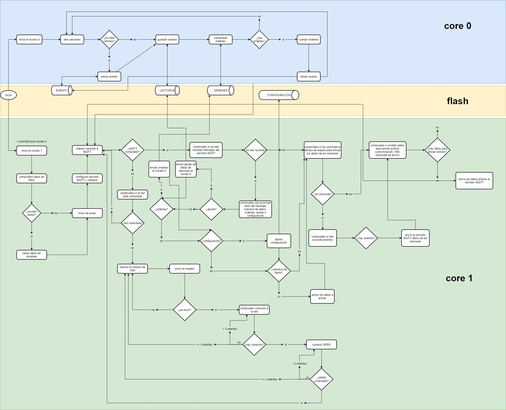

# Unidad de control "Genérica"

**Placa: ESP32 WOROOM 32**
**Autor:** Rubén Francisco Gazquez Rosales
**Descripción:** Nodo final para las unidades de control genéricas.
   Su uso es exclusivo para GPRS (NO WIFI).

## Librerías

- https://github.com/knolleary/pubsubclient
- http://librarymanager/all#PubSubClient
- https://tiny.cc/tinygsm-readme

## Configuración MQTT

| MQTT                    | Valor                       |
| ----------------------- | --------------------------- |
| Tópico de subscripción: | "server/test" --> "s/u/g/1" |
| Tópico de publicación:  | "client/test" --> "n/u/g/1" |
| Server MQTT:            | "mqtt.rubenfgr.com"         |
| APN Things-Mobile:      | "TM"                        |

>**p** = propiedad
>**o** = orden

### Arrays de publicación soportados

| Array               | Descripción                    |
| ------------------- | ------------------------------ |
| 1                   | comunicación                   |
| 2,p1,p2,p3,p4,p5    | datos de sensores y actuadores |
| 3,operador,señal,ip | datos de la sim                |
| 8,ss                | velocidad de envio de datos    |

### Arrays de subscripción soportados

| Array            | Descripción                                  |
| ---------------- | -------------------------------------------- |
| 1                | comunicación                                 |
| 2                | datos de sensores                            |
| 3                | datos de la sim                              |
| 5,o1,o2,o3,o4    | ordenes a actuadores                         |
| 7,ss             | configuración de velocidad de envio de datos |
| 9,p1,p2,p3,p4,p5 | configuración                                |

## Pines

### ENTRADAS (inputs)

| PIN | Destino      |
| --- | ------------ |
| D18 | SIM900L RX   |
| D19 | SIM900L TX   |
| D21 | SIM900 RESET |
| D13 | orden1       |
| D12 | orden2       |
| D14 | orden3       |
| D27 | orden4       |

### SALIDAS (outputs)

| PIN | Origen  |
| --- | ------- |
| D34 | sensor1 |
| D35 | sensor2 |
| D32 | sensor3 |
| D33 | sensor4 |
| D25 | sensor5 |

## Diagrama de flujo

Este diagrama es adaptable a todas las unidades de control. La lectura y cálculos sobre los sensores siempre se realizan sobre el núcleo 0 y el envío y recepción de datos sobre el servidor MQTT desde el núcleo 1. La memoria flash es compartida a los dos núclos por lo que se debe tener especial precaución a la hora de realizar escrituras sobre los datos.

